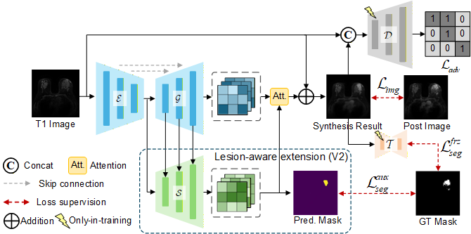

# Supervised Virtual Contrast Enhancement in Breast MRI with Multi-Domain Losses and Lesion-Aware Decoding

🏆 **Top-3 Winner** of the [MAMA-SYNTH Challenge](https://www.ub.edu/mama-synth/mama-synth) at **MICCAI 2026**  
<div>
  <a href="https://www.python.org/"></a> <a href="https://pytorch.org/"></a> <a href="https://www.pytorchlightning.ai/"></a> <a href="https://conferences.miccai.org/2026/"></a> <a href="LICENSE"></a>
</div>

This repository contains the official PyTorch implementation of our award-winning framework for **Virtual Contrast Enhancement in Breast MRI**. We present a multi-supervised and lesion-aware deterministic synthesis framework that achieves state-of-the-art performance without relying on complex generative models like Diffusion or Flow Matching.

## 🌟 Highlights

- **Small-Data, High-Performance**: We demonstrate that under limited task-specific training data, a carefully constrained simple U-Net architecture can achieve highly promising and clinically reliable performance, outperforming complex iterative probabilistic generative models.
- **Multi-Domain Supervision (V1)**: Our submitted model optimizes a 2D U-Net (with an EfficientNet encoder) using a comprehensive suite of losses: Image-domain ($L_1$, MSE, SSIM, ROI-SSIM), Perceptual (LPIPS), Frequency-domain (Wavelet), Adversarial (PatchGAN), and Segmentation-domain (via a frozen TinyUNet).
- **Lesion-Aware Decoding (V2)**: We introduce an auxiliary segmentation decoder parallel to the synthesis decoder. Multi-scale segmentation features are injected into the synthesis branch, and the predicted lesion probability map guides the final synthesis via a **soft spatial attention mechanism**, significantly improving tumor-boundary accuracy (HD95) and downstream segmentation utility.

## 🏗️ Framework Overview
<div align="center">
  
  <br>
  <em> Overview of the proposed supervised virtual contrast-enhancement framework. V1 utilizes the frozen TinyUNet for segmentation supervision, while V2 introduces the auxiliary lesion-aware decoding branch and attention mechanism.</em>
</div>

## ⚙️ Environment Setup
Our trining framework is built upon [PyTorch Lightning](https://lightning.ai/), a high-level framework that eliminates boilerplate code to let you focus on research logic while natively supporting scalable multi-GPU training and rigorous reproducibility.
```bash
# Clone the repository
git clone https://github.com/Saury997/Breast-MRI-Virtual-Contrast-Enhancement.git
cd Breast-MRI-Virtual-Contrast-Enhancement

# Create a conda environment
conda create -n mama-synth python=3.12
conda activate mama-synth

# Install dependencies (Ensure you install the correct PyTorch version for your CUDA)
pip install -r requirements.txt
```

## 📦 Dataset Preparation
This project utilizes the [MAMA-MIA dataset](https://www.synapse.org/Synapse:syn60868042/wiki/628716) provided by the MAMA-SYNTH Challenge. Please download it and preprocess the dataset according to the official guidelines in [this repo](https://github.com/mama-research/mama-synth/). Based on the training set provided in the challenge, we divided it into training and validation/test sets in a ratio of 8:2 for model development and debugging, which is determined by the `configs/split.json`. 

Below is a summary of the dataset's key characteristics:


| Attribute | Official dataset information |
|---|---|
| Cohort size | 1,506 pre-treatment breast cancer DCE-MRI cases | 
| Imaging modality | Pre-treatment T1-weighted dynamic contrast-enhanced breast MRI | 
| Source cohorts | Four public TCIA collections: ISPY1 (171), ISPY2 (980), DUKE (291), and NACT (64) |
| Clinical sites | More than 25 centres across the United States |
| Acquisition plane | Axial: 84.4%; sagittal: 15.6% |
| Magnetic field strength | 1.5 T: 72.1%; 3 T: 27.9% |
| Scanner manufacturer | GE: 64.1%; Siemens: 27.3%; Philips: 8.6% |
| Lesion annotations | Expert-corrected 3D segmentations of primary tumours and non-mass enhancement areas for all 1,506 cases | 
| Annotation process | Preliminary automatic masks corrected by 16 experts (9 years of breast-cancer experience on average), with additional visual quality assessment by two expert clinicians |
| Harmonized metadata | 49 variables: 21 clinical, 6 demographic, and 22 imaging variables | 

## 🚀 Training & Evaluation
We provide configuration files for both our submitted model (V1) and our post-submission lesion-aware extension (V2).

**Train V1 (Submitted Model):**
```bash
python src/training/train.py --config src/training/configs/v1.yaml
```
**Train V2 (Lesion-Aware Extension):**
```bash
python src/training/train.py --config src/training/configs/v2.yaml
```
**Evaluate model:**
```bash
python src/evaluation/eval.py --config src/training/configs/v1.yaml  --checkpoint checkpoints/v1.ckpt
```

## 🖼️ Qualitative Results
<div align="center">
  
  <br>
  <em> Representative cases showing the pre-contrast input, synthesized peak-enhancement image, ground-truth target, difference map, and the probability map predicted by the auxiliary segmentation branch.</em>
</div>

## 🙏 Acknowledgements
We thank the organizers of the [MAMA-SYNTH Challenge](https://www.ub.edu/mama-synth/mama-synth) and the creators of the [MAMA-MIA dataset](https://github.com/LidiaGarrucho/MAMA-MIA) for providing this valuable benchmark. 

We also acknowledge the open-source community for libraries like [PyTorch Lightning](https://lightning.ai/), [segmentation_models.pytorch](https://github.com/qubvel-org/segmentation_models.pytorch), and [Timm](https://github.com/huggingface/pytorch-image-models) which made this work possible.
